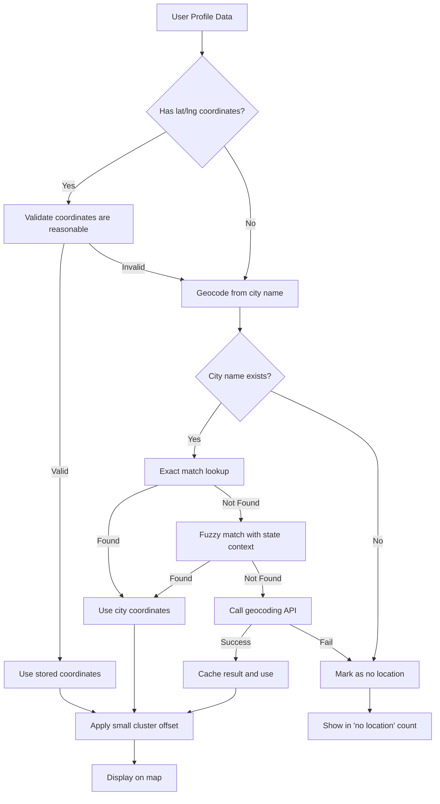

# Map Location Fix Plan

## Problem Statement
Users are showing up in the wrong city on the interactive map (e.g., someone in New York shows up in Las Vegas).

## Root Cause Analysis

After analyzing the codebase, I've identified **5 critical issues** causing incorrect map locations:

### Issue 1: Flawed City Name Matching Logic
**File:** [`src/components/discover/MapView.tsx`](src/components/discover/MapView.tsx:16-37)

The [`getCityCoordinates()`](src/components/discover/MapView.tsx:16) function has a dangerous partial matching algorithm:

```typescript
// Check for partial match - THIS IS THE MAIN PROBLEM
for (const [city, coords] of Object.entries(CITY_COORDINATES)) {
  if (normalized.includes(city) || city.includes(normalized)) {
    return coords;
  }
}
```

**Problem:** If a user's location is "New York", and the loop iterates through cities in order, it might match "york" inside another city name first, or match a shorter city name that happens to be a substring.

**Example Failure Cases:**
- "New York" could match "york" in another entry
- "San Jose" could match "san" in "San Francisco" (whichever comes first)
- "Las Vegas" could match before "North Las Vegas"
- Any city containing common words like "new", "san", "los" could mismatch

### Issue 2: Inconsistent Location Data Sources
**File:** [`src/components/discover/MapView.tsx`](src/components/discover/MapView.tsx:61-92)

The code checks multiple sources for location data with unclear priority:

```typescript
// Priority 1: demographics.location_lat/lng
// Priority 2: current_latitude/current_longitude (doesn't exist in schema!)
// Priority 3: home_city or demographics.location (city name geocoding)
```

**Problems:**
- `current_latitude`/`current_longitude` fields don't exist in the database schema
- `home_city` field doesn't exist in the database schema
- The fallback to city name geocoding uses the flawed matching logic

### Issue 3: State Abbreviation Stripping is Too Aggressive
**File:** [`src/components/discover/MapView.tsx`](src/components/discover/MapView.tsx:20-22)

```typescript
const normalized = cityString.toLowerCase()
  .replace(/,?\s*(ca|tx|ny|il|az|wa|or|fl|ga|co|nv|ma|tn|pa|oh|nc|mi|nj|va|md|mn|wi|mo|in|ky|sc|al|la|ok|ct|ia|ms|ar|ks|ut|nm|ne|wv|id|hi|nh|me|mt|ri|de|sd|nd|ak|vt|wy|dc)$/i, '')
  .trim();
```

**Problem:** This strips state abbreviations but doesn't use them for disambiguation. "Portland, OR" and "Portland, ME" would both become "portland" and match the first Portland in the dictionary (which is Oregon).

### Issue 4: Random Offset Applied to All Geocoded Locations
**File:** [`src/components/discover/MapView.tsx`](src/components/discover/MapView.tsx:86-91)

```typescript
const idHash = String(profile.id).split('').reduce((acc, char) => acc + char.charCodeAt(0), 0);
const offsetLat = ((idHash % 100) / 100 - 0.5) * 0.004;
const offsetLng = (((idHash * 7) % 100) / 100 - 0.5) * 0.004;
lat = coords.lat + offsetLat;
lng = coords.lng + offsetLng;
```

**Problem:** While this is intended to prevent marker overlap, it adds up to ~0.002 degrees (~220 meters) of random offset. This is fine for clustering but could be confusing if users expect exact locations.

### Issue 5: No Validation of Stored Coordinates
**File:** [`src/pages/Profile.tsx`](src/pages/Profile.tsx:300-338)

When users update their location via the "Use Current" button, coordinates are saved correctly. However:
- There's no validation that saved coordinates are within reasonable bounds
- There's no geocoding when users manually type a city name
- The location string and coordinates can become out of sync

## Solution Architecture



## Implementation Plan

### Step 1: Rewrite City Matching Logic
Create a new, more robust [`getCityCoordinates()`](src/components/discover/MapView.tsx:16) function:

1. **Exact match first** - Try exact lowercase match
2. **State-aware matching** - Parse "City, ST" format and use state for disambiguation
3. **Fuzzy matching with scoring** - Use Levenshtein distance or similar for typos
4. **No partial substring matching** - Remove the dangerous `includes()` logic

### Step 2: Add Geocoding API Integration
For cities not in the static dictionary:

1. Use OpenStreetMap Nominatim API (free, no API key required)
2. Cache results in localStorage to avoid repeated API calls
3. Rate limit requests to respect API terms

### Step 3: Fix Location Data Priority
Update the location resolution logic:

```typescript
// New priority order:
// 1. demographics.location_lat + demographics.location_lng (if both valid numbers)
// 2. Geocode from demographics.location (city name)
// 3. Skip user (no location data)
```

### Step 4: Add Location Validation
- Validate latitude is between -90 and 90
- Validate longitude is between -180 and 180
- Validate coordinates are not 0,0 (null island)

### Step 5: Improve City Coordinates Dictionary
Expand [`cityCoordinates.ts`](src/components/discover/cityCoordinates.ts:1) to include:
- State information for disambiguation
- More cities (especially non-California cities)
- Common alternate spellings

## Files to Modify

| File | Changes |
|------|---------|
| [`src/components/discover/MapView.tsx`](src/components/discover/MapView.tsx) | Rewrite location resolution logic, add geocoding |
| [`src/components/discover/cityCoordinates.ts`](src/components/discover/cityCoordinates.ts) | Restructure with state info, add more cities |
| [`src/pages/Profile.tsx`](src/pages/Profile.tsx) | Add geocoding when user types city name manually |

## New Files to Create

| File | Purpose |
|------|---------|
| `src/lib/geocoding.ts` | Geocoding utilities and API integration |

## Testing Checklist

- [ ] User with explicit lat/lng shows at correct location
- [ ] User with "New York, NY" shows in New York (not elsewhere)
- [ ] User with "Portland, OR" shows in Oregon Portland
- [ ] User with "Portland, ME" shows in Maine Portland
- [ ] User with "San Francisco" shows in San Francisco (not San Jose)
- [ ] User with typo like "Los Angelas" still matches Los Angeles
- [ ] User with unknown city triggers geocoding API
- [ ] Users without any location data don't appear on map
- [ ] Multiple users in same city don't stack exactly on top of each other

## Risk Assessment

| Risk | Mitigation |
|------|------------|
| Geocoding API rate limits | Cache results, batch requests |
| API unavailability | Fall back to static dictionary |
| Performance impact | Memoize results, lazy load |
| Breaking existing functionality | Keep backward compatibility with stored coordinates |
